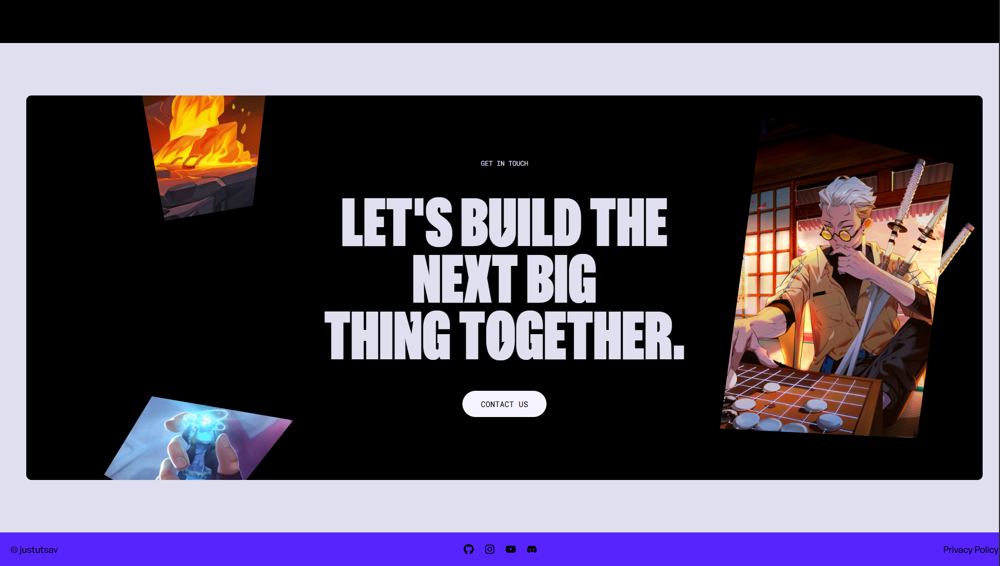

# Zentry Clone 🎮

 

A visually immersive and highly animated gaming website, designed to replicate the premium feel of the original Zentry platform. This project showcases advanced frontend techniques, featuring complex scroll animations, video storytelling, and a modern "bento grid" layout.

**🚀 Live Demo:** [https://zentry-clone-website-mu.vercel.app/](https://zentry-clone-website-mu.vercel.app/)

## ✨ Features

- **Immersive Hero Section:** Cinematic video background with smooth entry transitions.
- **Advanced Animations:** High-performance scroll-triggered effects and text reveals using GSAP.
- **Modern UI/UX:** Sleek, responsive design utilizing a "bento grid" style layout.
- **Interactive Elements:** 3D-style hover effects and fluid navigation.
- **Responsive Design:** Fully optimized for desktop, tablet, and mobile devices.

## 🛠️ Tech Stack

- **Framework:** [React.js](https://react.dev/)
- **Build Tool:** [Vite](https://vitejs.dev/)
- **Styling:** [Tailwind CSS](https://tailwindcss.com/)
- **Animations:** [GSAP (GreenSock)](https://gsap.com/)
- **Icons:** React Icons

## 📸 Screenshots

| Hero Section | Animated Section |
|:---:|:---:|
|  |  |

| Hero Alternate | Footer |
|:---:|:---:|
|  |  |

## ⚙️ Installation & Running Locally

Follow these steps to set up the project locally on your machine:

1. **Clone the repository**
    ```bash
   git clone https://github.com/justutsav/Zentry-clone-Website.git
   cd Zentry-clone-Website
    ```

2. **Install dependencies**
    ```bash
    npm install
    ```

4. **Start the development server**
    ```bash
    npm run dev
    ```
    ```Open your browser Visit http://localhost:5173 to view the application.```

## 📂 Project Structure

```bash
├── Screenshots/         # Screenshots used in the README
├── public/              # Static assets (fonts, videos, images)
├── src/                 # Source code
│   ├── assets/          # Local assets
│   ├── components/      # Reusable UI components
│   ├── App.jsx          # Main application component
│   └── main.jsx         # Entry point
├── index.html           # HTML template
├── package.json         # Dependencies & scripts
├── package-lock.json
├── postcss.config.js    # PostCSS config for Tailwind
├── tailwind.config.js   # TailwindCSS customization
├── eslint.config.js     # ESLint config
└── vite.config.js       # Vite configuration file

  ```

## 🤝 Credits & Inspiration
This project was built for educational purposes to master advanced animation techniques in React.

Design Inspiration: Heavily inspired by the official Zentry website.

Tutorial Reference: Special thanks to JavaScript Mastery for the educational guide on building award-winning websites. You can watch the video here: Build and Deploy an Awwwards Winning Website.
